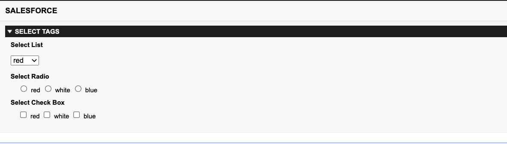
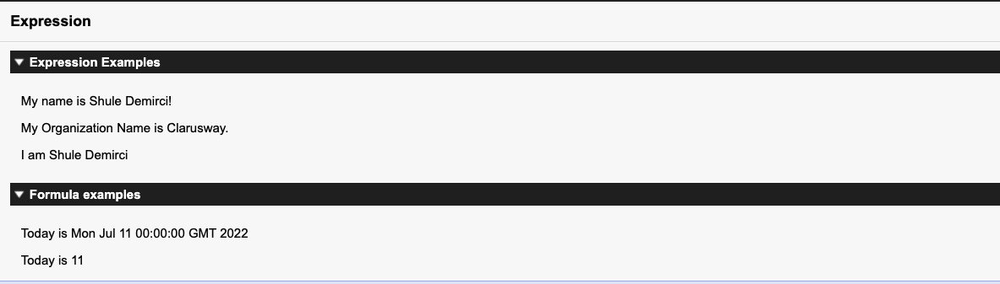

# Visualforce-Projects

<h2>Select Options:</h2>

 

 
 
   

<h2>Expressions:</h2>

 

 
 
   
<h2>Standard Controllers:</h2>
 

 
 
   

<h2>Standard List Controllers:</h2>
 

 
 
   
<h2>Standard Custom Controllers:</h2>
 

 
 
   
  <h2>GetterSetterExample:</h2>
 

 
 
   
 <h2>Example 2 Custom Controller:</h2>
 

 
 
   
  <h2>Standard Controller with Extension:</h2>
 

 
 
   
